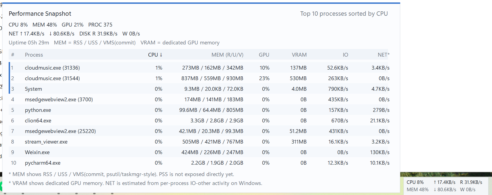

# minimal_taskbar_monitor

一个参考 `TrafficMonitor` 的最小版任务栏性能监视器，只保留以下功能：

- Win10 / Win11 任务栏嵌入
- CPU、内存、上下行网速、GPU 占用、磁盘IO
- 托盘图标、右键退出、开机自启动
- 指标显隐配置与本地 JSON 缓存

不包含以下功能：

- 浮动窗口
- 复杂设置界面
- 皮肤
- 插件
- 联网更新
- 温度监控
- ...

## Build

```powershell
cmake -S . -B build -G "Visual Studio 17 2022" -A x64
cmake --build build --config Release
```

生成物：

- `build/Release/minimal_taskbar_monitor.exe`

## Notes
- 主要适配主显示器上的任务栏。
- Win10 使用“压缩任务按钮区域并插入窗口”的方式。
- Win11 使用“贴近通知区左侧”的方式。
- 不支持Win7

## Screenshot


